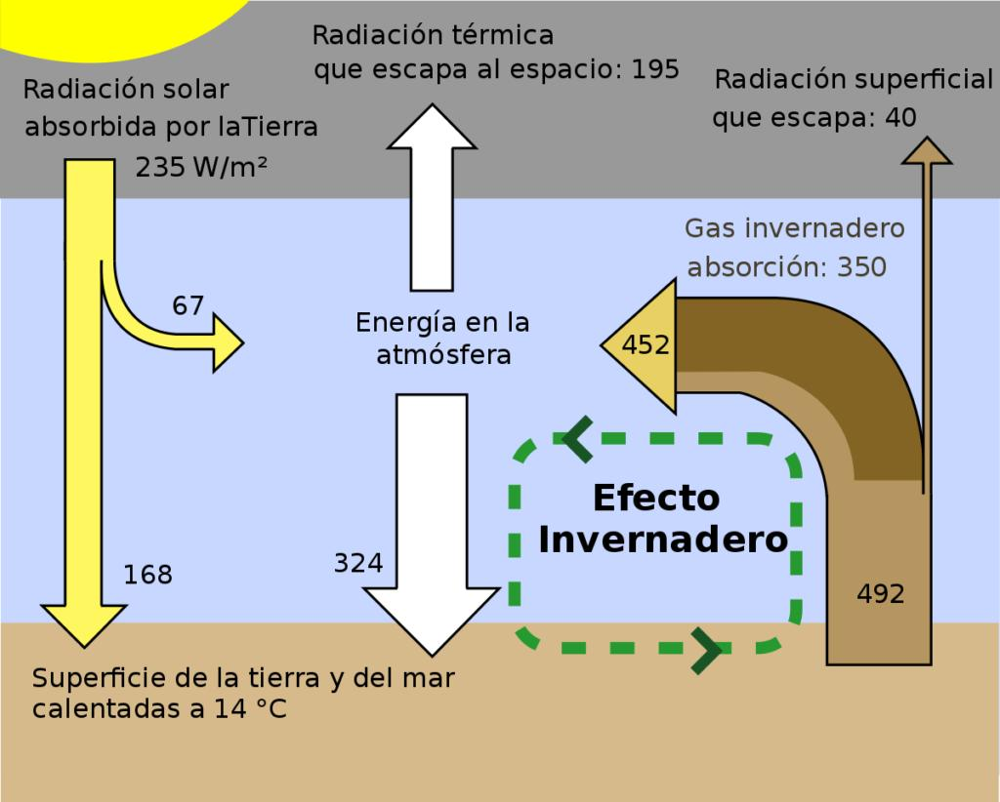
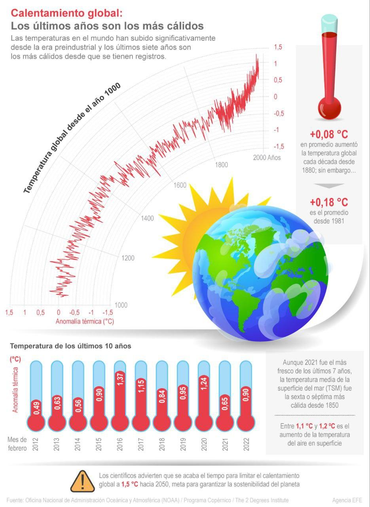
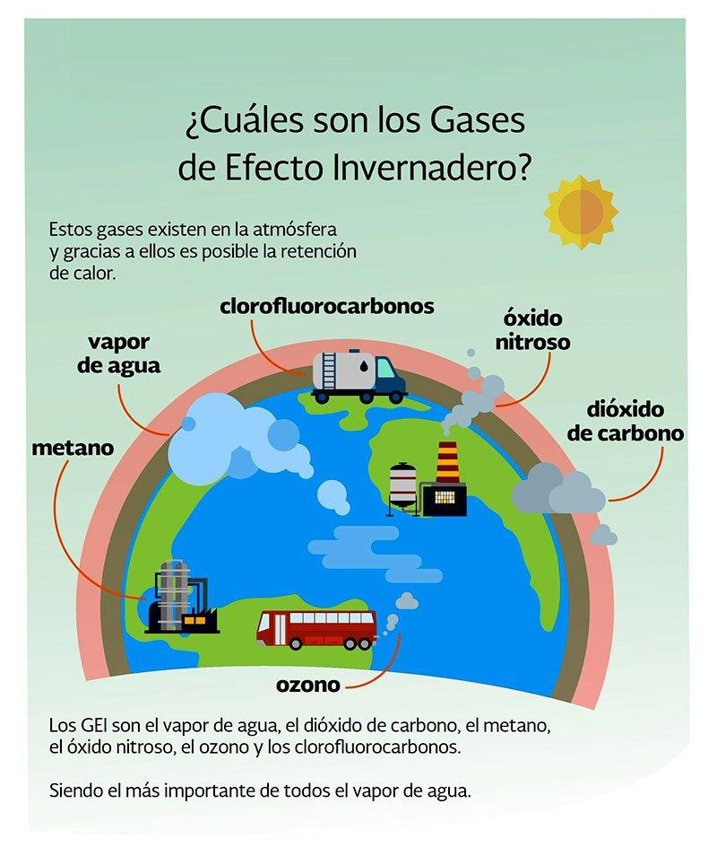

# Calentamiento global
Este proyecto es un desarrollo de una pág web que busca concientizar mediante la siguiente información: (Calentamiento global): Concepto, causas, consecuencias, soluciones y preguntas sueltas para debates.

# 1: ¿Qué es el calentamiento global?
Es el aumento progresivo de la temperatura promedio de la Tierra gracias a gases de efecto invernadero en la atmósfera.
Estos gases ( CO2, metano, óxidos de nitrógeno, etc ) atrapan el calor de Sol.
El efecto invernadero es natural y necesario, el problema es su aceleración por el hombre.

# 2: ¿Qué causas generan el aceleramiento del calentamiento global?
Estas causas de dividen en 2:

## 1) Humanas (Principales):
- Quema de combustibles fósiles
- Deforestación
- Agricultura y ganadería
- Industria y consumo

## 2) Naturales (Secundarias):
- Erupciones volcánicas
- Cambios en la radiación solar

# 3: Consecuencias del calentamiento global
## Ambientales:
- Aumento de la temperatura global
- Derretimiento de glaciares / polos
- Subida del nivel del mar

## Fenómenos extremos:
- Huracanes
- Sequías prolongadas
- Inundaciones intensas

## Biodiversidad:
- Extinción de especies
- Pérdida de ecosistemas

## Sociales y Económicas:
- Falta de agua y comida
- Migracioens inusuales
- Conflictos por recursos 
