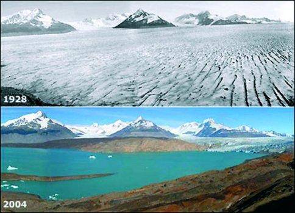
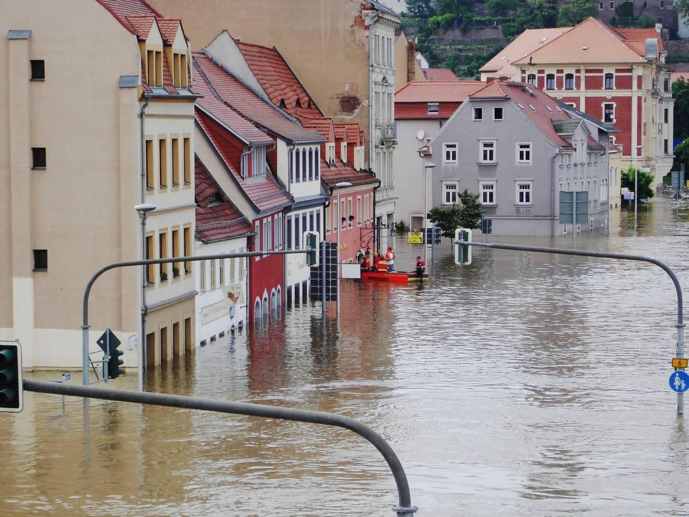
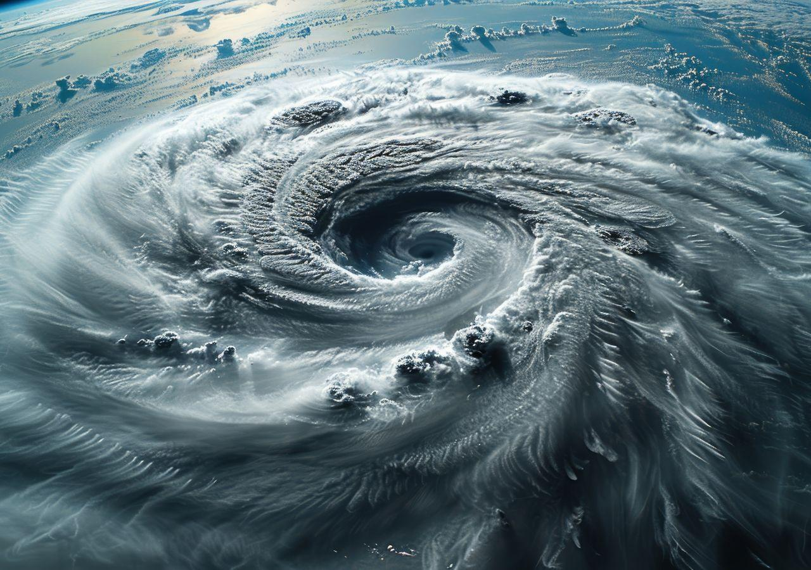

# Calentamiento global
Este proyecto es un desarrollo de una pág web que busca concientizar mediante la siguiente información: (Calentamiento global): Concepto, causas, consecuencias, soluciones y preguntas sueltas para debates.

# 1: ¿Qué es el calentamiento global?
Es el aumento progresivo de la temperatura promedio de la Tierra gracias a gases de efecto invernadero en la atmósfera.
Estos gases ( CO2, metano, óxidos de nitrógeno, etc ) atrapan el calor de Sol.
El efecto invernadero es natural y necesario, el problema es su aceleración por el hombre.

# 2: ¿Qué causas generan el aceleramiento del calentamiento global?
Estas causas se dividen en 2:

## 1) Humanas (Principales):
- Quema de combustibles fósiles
- Deforestación
- Agricultura y ganadería
- Industria y consumo

## 2) Naturales (Secundarias):
- Erupciones volcánicas
- Cambios en la radiación solar

# 3: Consecuencias del calentamiento global
## Ambientales:
- Aumento de la temperatura global
- Derretimiento de glaciares / polos
- Subida del nivel del mar

## Fenómenos extremos:
- Huracanes
- Sequías prolongadas
- Inundaciones intensas

## Biodiversidad:
- Extinción de especies
- Pérdida de ecosistemas

## Sociales y Económicas:
- Falta de agua y comida
- Migracioens inusuales
- Conflictos por recursos

# 4: ¿Qué podemos hacer para deterne el calentamiento global?
## Reducir las causas:
- Uso de energías renovables
- Reducir emisiones de CO2
- Reforestación
- Transporte sostenible

## Adaptación:
- Construcciones resistentes al clima
- Mejor gestión del agua
- Nuevas técnicas agricolas

## Globales:
- Acuerdos Internacionales
- Educación ambiental
- Cambios enm hábito de consumo

# Conclusiones:
El calentamiento global es un problema causado principalmente por el ser humano que afecta al clima, los ecosistemas y la sociedad. Aunque sus efectos son graves, existen soluciones si se aplican de forma global y urgente.

# Preguntas para debate:
## 1. Es posible crecer económicamente sin contaminar?
## 2. ¿Quién tiene mayor responsabilidad: países desarrollados o en desarrollo?
## 3. ¿Las soluciones actuales son suficientes o demasiado lentas?
## 4. ¿La tecnología podrá revertir el daño ambiental?
## 5. ¿Es más importante prevenir o adaptarse?
